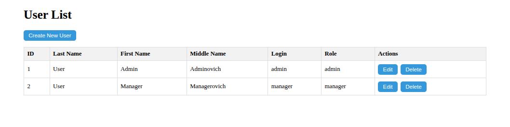
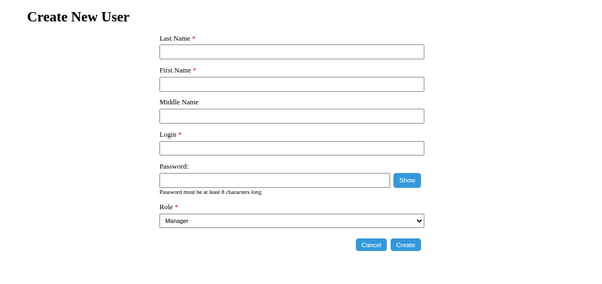
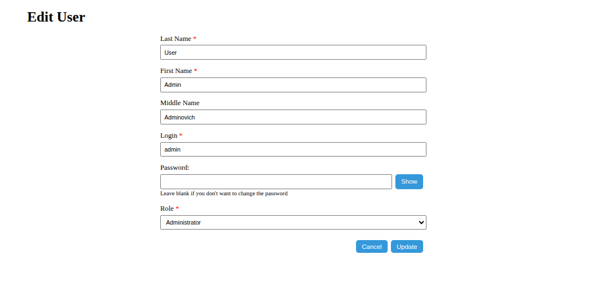
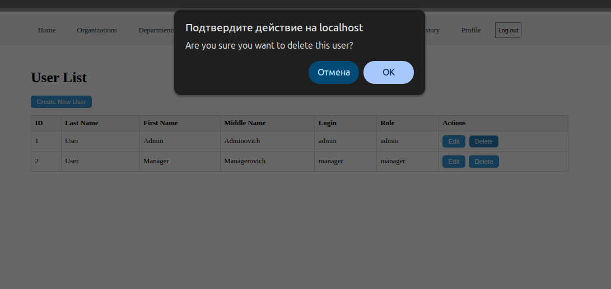
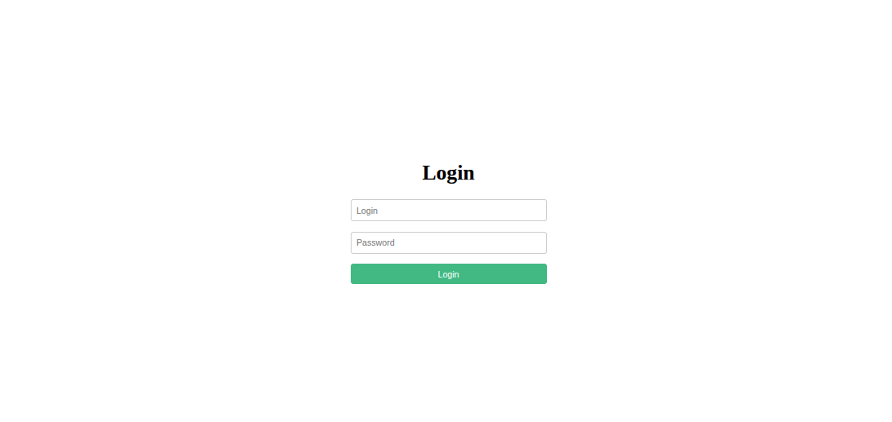
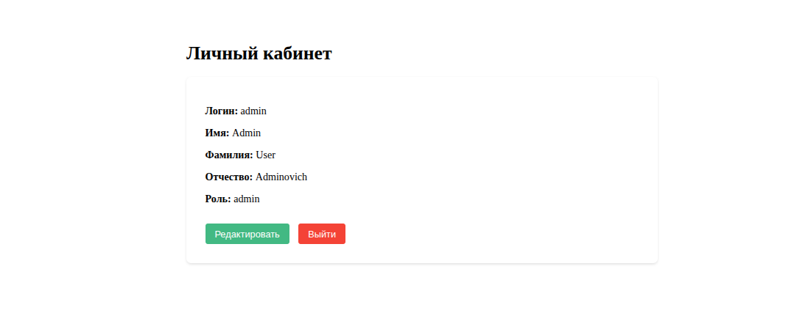

# Authentication & Users API

Управление аутентификацией и пользователями системы.

---

## Аутентификации

| Метод | URL                |  Описание                                      | Доступ                      |
|-------|--------------------|------------------------------------------------|-----------------------------|
| POST  | `/api/auth/login`  | Авторизация по логину и паролю                 | Все                         |
| POST  | `/api/auth/logout` | Выход из системы                               | Авторизованные пользователи |
| GET   | `/api/auth/check`  | Проверка текущего авторизованного пользователя | Авторизованные пользователи |

### POST /api/auth/login

Пример запроса
```json
{
  "login": "admin",
  "password": "admin"
}
```

Пример ответа (200 OK)
```json
{
  "message": "Login successful"
}
```

### POST /api/auth/logout
Пример ответа (200 OK)
```json
{
  "message":"Logged out successfully"
}
```

### GET /api/auth/check
Пример ответа (304 Not Modified)
```json
{
  "authenticated":true,
  "user":{
    "name":"Admin User"
  }
}
```
---

## Список маршрутов

| Метод   | URL              | Описание                           | Доступ         |
|---------|------------------|------------------------------------|----------------|
| GET     | `/api/users`     | Получить список всех пользователей | admin, manager |
| GET     | `/api/users/:id` | Получить пользователя по ID        | admin          |
| POST    | `/api/users`     | Создать нового пользователя        | admin          |
| PUT     | `/api/users/:id` | Обновить пользователя              | admin          |
| DELETE  | `/api/users/:id` | Удалить пользователя               | admin          |
| GET     | `/api/users/me`  | Получить текущего пользователя     | авторизованные |
| PUT     | `/api/users/me`  | Обновить текущего пользователя     | авторизованные |

## Структура таблицы user

| Поле          | Тип            | Описание                                  |
|---------------|----------------|-------------------------------------------|
| `id`          | `serial`       | Уникальный идентификатор                  |
| `first_name`  | `varchar(255)` | Имя пользователя                          |
| `last_name`   | `varchar(255)` | Фамилия пользователя                      |
| `patronymic`  | `varchar(255)` | Отчество пользователя (может быть пустым) |
| `login`       | `varchar(255)` | Уникальный логин                          |
| `password`    | `varchar(255)` | Хэш пароля                                |
| `role`        | `enum`         | Роль (`admin`, `manager`, `employee`)     |
| `created_at`  | `timestamp`    | Дата создания                             |
| `updated_at`  | `timestamp`    | Дата последнего обновления                |

## Примеры запросов и ответов

GET /api/users

Получение списка всех пользователей (только для admin)

```json
{
    "id": 1,
    "first_name": "Admin",
    "last_name": "User",
    "patronymic": "Adminovich",
    "login": "admin",
    "password": "$argon2id$v=19$m=65536,t=3,p=4$2LYuq39MKjuREShqoD3rIQ$hT1EMMlAws6WwAgEb3aH4BLDOt+zeQXwjFp2gVMjZvs",
    "role": "admin",
    "created_at": "2025-05-14T22:37:32.614Z",
    "updated_at": "2025-05-14T22:37:32.614Z"
}
```

GET /api/users/me

Получение текущего пользователя (авторизованный пользователь)

```json
{
  "id": 1,
  "first_name": "Admin",
  "last_name": "User",
  "patronymic": "Adminovich",
  "login": "admin",
  "password": "$argon2id$v=19$m=65536,t=3,p=4$2LYuq39MKjuREShqoD3rIQ$hT1EMMlAws6WwAgEb3aH4BLDOt+zeQXwjFp2gVMjZvs",
  "role": "admin",
  "created_at": "2025-05-14T22:37:32.614Z",
  "updated_at": "2025-05-14T22:37:32.614Z"
}
```

---

## Интерфейс пользователя

Ниже представлены скриншоты пользовательского интерфейса для управления пользователей:

### Общий список пользователей



---

### Создание пользователя



---

### Редактирование пользователя



---

### Удаление пользователя



---

### Автиоризация



---

### Профиль



---