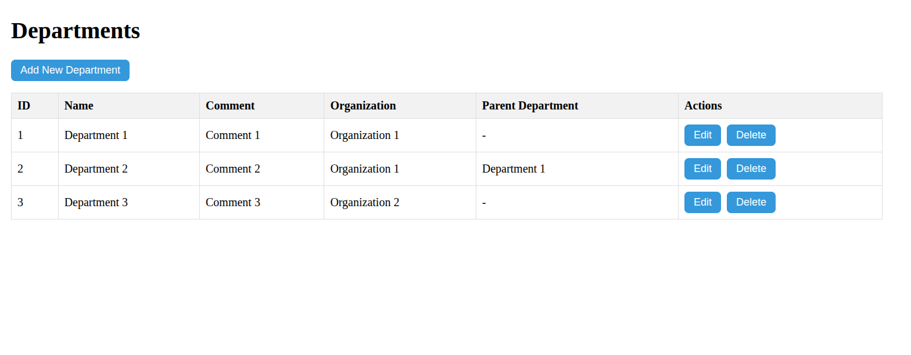
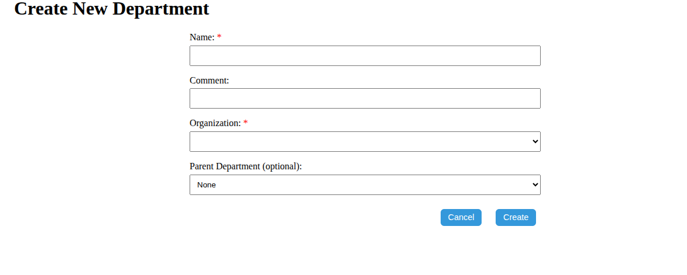
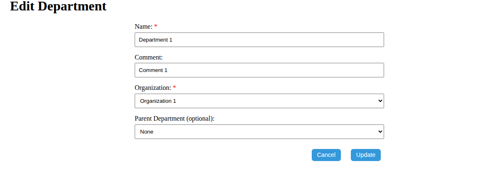
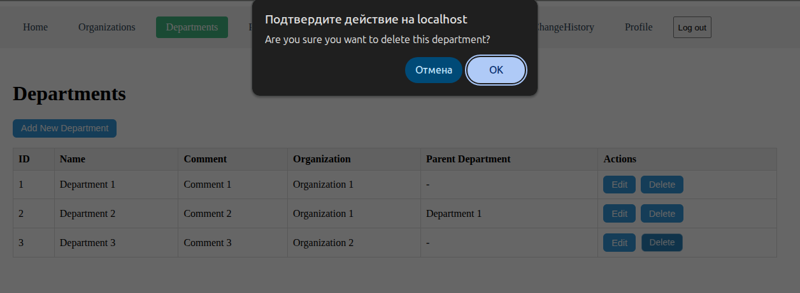

# Departments API

Управление отделами внутри организаций. Отделы могут иметь иерархическую структуру (родительские/дочерние).

---

## Список маршрутов

| Метод   | Путь                       | Описание                             |
|---------|----------------------------|--------------------------------------|
| GET     | `/api/departments`         | Получить список всех отделов         |
| GET     | `/api/departments/:id`     | Получить отдел по ID                 |
| GET     | `/api/departments/parents` | Получить список родительских отделов |
| POST    | `/api/departments`         | Создать новый отдел                  |
| PUT     | `/api/departments/:id`     | Обновить отдел по ID                 |
| DELETE  | `/api/departments/:id`     | Удалить отдел по ID                  |

---

## Структура таблицы `department`

| Поле               | Тип            | Описание                                    |
|--------------------|----------------|---------------------------------------------|
| `id`               | `serial`       | Уникальный идентификатор                    |
| `name`             | `varchar(255)` | Название отдела                             |
| `comment`          | `text`         | Комментарий                                 |
| `organization_id`  | `integer`      | Идентификатор организации (внешний ключ)    |
| `parent_id`        | `integer`      | Родительский отдел (внешний ключ, nullable) |
| `created_at`       | `timestamp`    | Дата создания                               |
| `updated_at`       | `timestamp`    | Дата последнего обновления                  |
| `deleted_at`       | `timestamp`    | Дата удаления                               |

---

## Валидация

| Поле                | Тип       | Обязательное   | Ограничения                      |
|---------------------|-----------|----------------|----------------------------------|
| `name`              | string    | да             | от 2 до 255 символов             |
| `comment`           | string    | нет            | может быть пустым                |
| `organization_id`   | integer   | да             | положительное число              |
| `parent_id`         | integer   | нет            | положительное число или `null`   |


## Пример данных

```json
[
  {
    "id": 1,
    "name": "Department 1",
    "comment": "Comment 1",
    "organization_id": 1,
    "parent_id": null,
    "created_at": "2025-05-14T22:37:32.614Z",
    "updated_at": "2025-05-14T22:37:32.614Z",
    "deleted_at": null
  }
]
```
---

## Примеры запросов и ответов

### POST /api/departments

Создание нового отдела

Пример запроса
```json
{
    "name": "Department",
    "comment": "",
    "organization_id": 1,
    "parent_id": null
}
```
Пример ответа (201 Created)
```json
{
    "id": 6,
    "name": "Department",
    "comment": "",
    "organization_id": 1,
    "parent_id": null,
    "created_at": "2025-05-18T20:35:17.882Z",
    "updated_at": "2025-05-18T20:35:17.882Z",
    "deleted_at": null
}
```

### PUT /api/departments/6

Обновление информации об отделе

Пример запроса
```json
{
    "comment": "Department",
    "parent_id": 3
}
```
Пример ответа (200 OK)
```json
{
    "id": 6,
    "name": "Department",
    "comment": "Department",
    "organization_id": 1,
    "parent_id": 3,
    "created_at": "2025-05-18T20:35:17.882Z",
    "updated_at": "2025-05-18T20:36:15.671Z",
    "deleted_at": null
}
```

### DELETE /api/departments/6

Удаление отдела по ID

Пример запроса

```http
DELETE /api/departments/6
```

Пример ответа (204 No Content)

Тело ответа отсутствует.

---

## Интерфейс пользователя

Ниже представлены скриншоты пользовательского интерфейса для управления отделами:

### Общий список отделов



---

### Создание отдела



---

### Редактирование отдела



---

### Удаление отдела



---