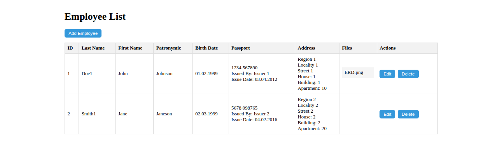
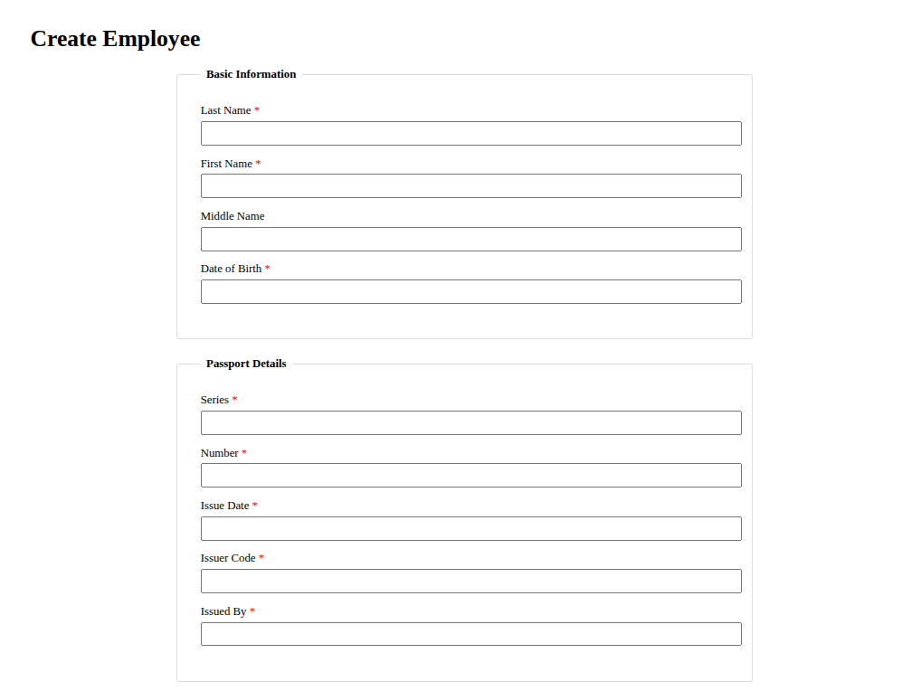
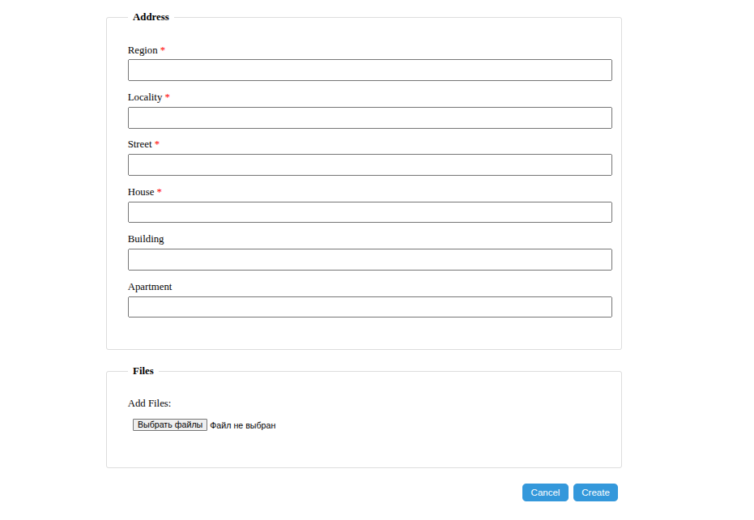
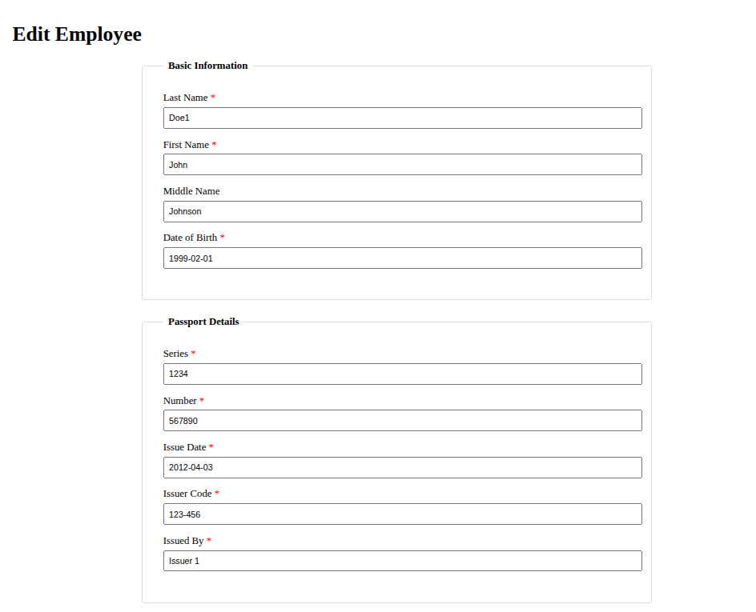
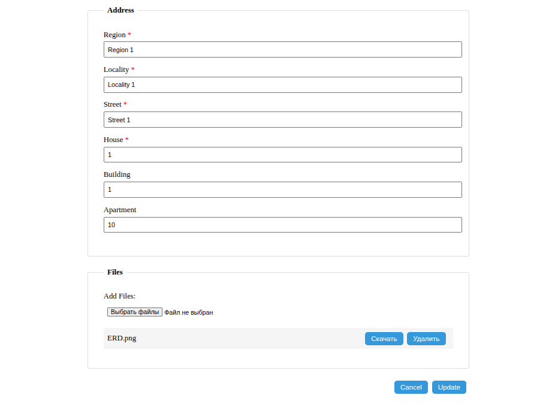
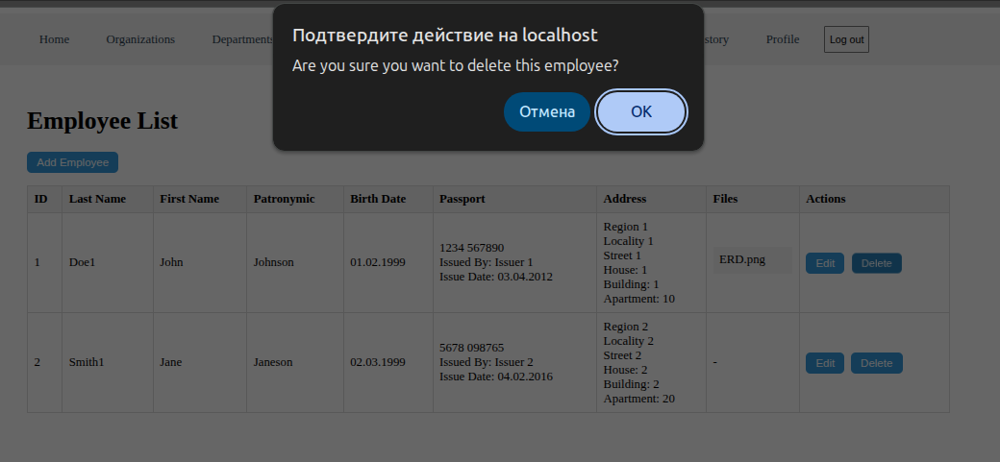

# Employees API

Управление данными сотрудников, включая персональную информацию, паспортные данные, адреса и прикрепленные файлы.

---

## Список маршрутов

| Метод    | Путь                     | Описание                         |
|----------|--------------------------|----------------------------------|
| GET      | `/api/employees`         | Получить список всех сотрудников |
| GET      | `/api/employees/:id`     | Получить данные сотрудника по ID |
| POST     | `/api/employees`         | Создать нового сотрудника        |
| PUT      | `/api/employees/:id`     | Обновить данные сотрудника       |
| DELETE   | `/api/employees/:id`     | Удалить сотрудника               |

---

## Структуры таблиц

### Таблица `employee`

| Поле            | Тип            | Описание                 |
|-----------------|----------------|--------------------------|
| `id`            | `serial`       | Уникальный идентификатор |
| `first_name`    | `varchar(255)` | Имя                      |
| `last_name`     | `varchar(255)` | Фамилия                  |
| `patronymic`    | `varchar(255)` | Отчество                 |
| `birth_date`    | `date`         | Дата рождения            |
| `created_at`    | `timestamp`    | Дата создания            |
| `updated_at`    | `timestamp`    | Дата обновления          |
| `deleted_at`    | `timestamp`    | Дата удаления            |

### Таблица `passport`

| Поле          | Тип             | Описание                 |
|---------------|-----------------|--------------------------|
| `id`          | `serial`        | Уникальный идентификатор |
| `series`      | `varchar(4)`    | Серия паспорта           |
| `number`      | `varchar(6)`    | Номер паспорта           |
| `issue_date`  | `date`          | Дата выдачи              |
| `issuer_code` | `varchar(7)`    | Код подразделения        |
| `issuer`      | `varchar(255)`  | Кем выдан                |
| `employee_id` | `integer`       | Ссылка на сотрудника     |

### Таблица `address`

| Поле           | Тип            | Описание                   |
|----------------|----------------|----------------------------|
| `id`           | `serial`       | Уникальный идентификатор   |
| `region`       | `varchar(255)` | Область                    |
| `locality`     | `varchar(255)` | Населенный пункт           |
| `street`       | `varchar(255)` | Улица                      |
| `house`        | `varchar(10)`  | Дом                        |
| `building`     | `varchar(10)`  | Корпус                     |
| `apartment`    | `varchar(10)`  | Квартира                   |
| `employee_id`  | `integer`      | Ссылка на сотрудника       |

### Таблица `file`

| Поле          | Тип            | Описание                 |
|---------------|----------------|--------------------------|
| `id`          | `serial`       | Уникальный идентификатор |
| `name`        | `varchar(255)` | Имя файла                |
| `path`        | `varchar(255)` | Путь к файлу             |
| `employee_id` | `integer`      | Ссылка на сотрудника     |

---

## Пример данных

```json
{
    "id": 1,
    "first_name": "John",
    "last_name": "Doe1",
    "patronymic": "Johnson",
    "birth_date": "1999-02-01T00:00:00.000Z",
    "created_at": "2025-05-14T22:37:32.614Z",
    "updated_at": "2025-05-18T21:52:08.627Z",
    "deleted_at": null,
    "passport": {
        "id": 1,
        "series": "1234",
        "number": "567890",
        "issue_date": "2012-04-03T00:00:00.000Z",
        "issuer_code": "123-456",
        "issuer": "Issuer 1",
        "employee_id": 1,
        "created_at": "2025-05-14T22:37:32.614Z",
        "updated_at": "2025-05-18T21:52:08.627Z"
    },
    "address": {
        "id": 1,
        "region": "Region 1",
        "locality": "Locality 1",
        "street": "Street 1",
        "house": "1",
        "building": "1",
        "apartment": "10",
        "employee_id": 1,
        "created_at": "2025-05-14T22:37:32.614Z",
        "updated_at": "2025-05-18T21:52:08.627Z"
    },
    "files": [
        {
            "id": 1,
            "name": "ERD.png",
            "path": "/app/uploads/1747605128615-83085514-ERD.png",
            "employee_id": 1,
            "created_at": "2025-05-18T21:52:08.627Z",
            "updated_at": "2025-05-18T21:52:08.627Z"
        }
    ]
}
```

## Примеры запросов и ответов

### POST /api/employees

Создание нового сотрудника

Пример запроса
```json
{
  "first_name":"Example",
  "last_name":"Example",
  "patronymic":"Example",
  "birth_date":"2003-08-05",
  "passport": {
    "series":"9787",
    "number":"123546",
    "issue_date":"2023-08-05",
    "issuer_code":"412-432",
    "issuer":"2003-08-05"
  },"address":{
    "region":"2003-08-05",
    "locality":"2003-08-05",
    "street":"2003-08-05",
    "house":"2",
    "building":"3",
    "apartment":"1"
  }, "files": [
    {
      "id": 2,
      "name": "ERD (1).png",
      "path": "/app/uploads/1747605615498-973411175-ERD (1).png",
      "employee_id": 7,
      "created_at": "2025-05-18T22:00:15.499Z",
      "updated_at": "2025-05-18T22:00:15.499Z"
    }
  ]
}
```
Пример ответа (201 Created)
```json
{
  "id": 7,
  "first_name": "Example",
  "last_name": "Example",
  "patronymic": "Example",
  "birth_date": "2003-08-05T00:00:00.000Z",
  "created_at": "2025-05-18T22:00:15.499Z",
  "updated_at": "2025-05-18T22:00:15.499Z",
  "deleted_at": null,
  "passport": {
    "id": 3,
    "series": "9787",
    "number": "123546",
    "issue_date": "2023-08-05T00:00:00.000Z",
    "issuer_code": "412-432",
    "issuer": "2003-08-05",
    "employee_id": 7,
    "created_at": "2025-05-18T22:00:15.499Z",
    "updated_at": "2025-05-18T22:00:15.499Z"
  },
  "address": {
    "id": 3,
    "region": "2003-08-05",
    "locality": "2003-08-05",
    "street": "2003-08-05",
    "house": "2",
    "building": "3",
    "apartment": "1",
    "employee_id": 7,
    "created_at": "2025-05-18T22:00:15.499Z",
    "updated_at": "2025-05-18T22:00:15.499Z"
  },
  "files": [
    {
      "id": 2,
      "name": "ERD (1).png",
      "path": "/app/uploads/1747605615498-973411175-ERD (1).png",
      "employee_id": 7,
      "created_at": "2025-05-18T22:00:15.499Z",
      "updated_at": "2025-05-18T22:00:15.499Z"
    }
  ]
}
```

### PUT /api/employees/2

Обновление информации о сотруднике

Пример запроса
```json
{
  "first_name":"Jane",
  "last_name":"Smith1",
  "patronymic":"Janeson",
  "birth_date":"1999-03-02",
  "passport":{
    "id":2,
    "series":"5678",
    "number":"098765",
    "issue_date":"2016-02-04",
    "issuer_code":"789-012",
    "issuer":"Issuer 2",
    "employee_id":2,
    "created_at":"2025-05-14T22:37:32.614Z",
    "updated_at":"2025-05-14T22:37:32.614Z"},
  "address":{
    "id":2,
    "region":"Region 2",
    "locality":"Locality 2",
    "street":"Street 2",
    "house":"2",
    "building":"2",
    "apartment":"20",
    "employee_id":2,
    "created_at":"2025-05-14T22:37:32.614Z",
    "updated_at":"2025-05-14T22:37:32.614Z"
  }
}
```
Пример ответа (200 OK)
```json
{
  "id": 2,
  "first_name": "Jane",
  "last_name": "Smith1",
  "patronymic": "Janeson",
  "birth_date": "1999-03-02T00:00:00.000Z",
  "created_at": "2025-05-14T22:37:32.614Z",
  "updated_at": "2025-05-18T22:05:19.751Z",
  "deleted_at": null,
  "passport": {
    "id": 2,
    "series": "5678",
    "number": "098765",
    "issue_date": "2016-02-04T00:00:00.000Z",
    "issuer_code": "789-012",
    "issuer": "Issuer 2",
    "employee_id": 2,
    "created_at": "2025-05-14T22:37:32.614Z",
    "updated_at": "2025-05-18T22:05:19.751Z"
  },
  "address": {
    "id": 2,
    "region": "Region 2",
    "locality": "Locality 2",
    "street": "Street 2",
    "house": "2",
    "building": "2",
    "apartment": "20",
    "employee_id": 2,
    "created_at": "2025-05-14T22:37:32.614Z",
    "updated_at": "2025-05-18T22:05:19.751Z"
  },
  "files": []
}
```

### DELETE /api/employees/2

Удаление сотрудника по ID

Пример запроса

```http
DELETE /api/employees/2
```

Пример ответа (204 No Content)

Тело ответа отсутствует.

---

## Интерфейс пользователя

Ниже представлены скриншоты пользовательского интерфейса для управления сотрудниками:

### Общий список сотрудников



---

### Создание сотрудника




---

### Редактирование сотрудника




---

### Удаление сотрудника



---