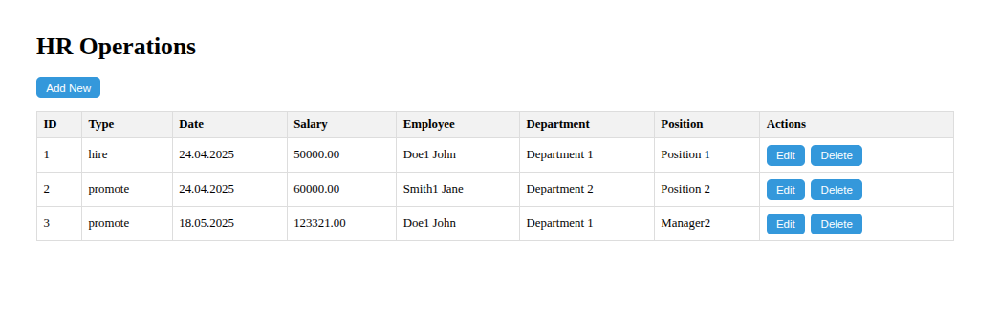
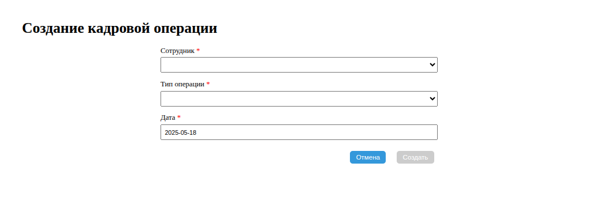

# HR Operations API

Управление кадровыми операциями: прием, увольнение, переводы и изменения должностей.

---

## Список маршрутов

| Метод       | Путь                                      | Описание                                |
|-------------|-------------------------------------------|-----------------------------------------|
| GET         | `/api/hr-operations`                      | Получить список всех кадровых операций  |
| GET         | `/api/hr-operations/:id`                  | Получить кадровую операцию по ID        |
| GET         | `/api/hr-operations/employee/:id/history` | Получить историю операций по сотруднику |
| POST        | `/api/hr-operations`                      | Создать новую кадровую операцию         |
| PUT         | `/api/hr-operations/:id`                  | Обновить кадровую операцию              |
| DELETE      | `/api/hr-operations/:id`                  | Удалить кадровую операцию               |

---

## Структура таблицы `hr_operations`

| Поле             | Тип               | Описание                                                   |
|------------------|-------------------|------------------------------------------------------------|
| `id`             | `serial`          | Уникальный идентификатор                                   |
| `operation_type` | `operation_type`  | Тип операции (`hire`,`fire`,`promote`,`demote`,`transfer`) |
| `salary`         | `decimal(8,2)`    | Зарплата                                                   |
| `date`           | `timestamp`       | Дата операции                                              |
| `employee_id`    | `integer`         | Ссылка на сотрудника (`employee.id`)                       |
| `department_id`  | `integer`         | Ссылка на отдел (`department.id`)                          |
| `position_id`    | `integer`         | Ссылка на должность (`position.id`)                        |
| `created_at`     | `timestamp`       | Дата создания                                              |
| `updated_at`     | `timestamp`       | Дата обновления                                            |
| `deleted_at`     | `timestamp`       | Дата удаления                                              |

---

## Валидация

| Поле             | Тип       | Обязательное                             | Условия                                              |
|------------------|-----------|------------------------------------------|------------------------------------------------------|
| `operation_type` | string    | да                                       | Один из: `hire`,`fire`,`promote`,`demote`,`transfer` |
| `salary`         | number    | для `hire`,`promote`,`demote`,`transfer` | Положительное число                                  |
| `date`           | date      | да                                       | Дата в прошлом или настоящем                         |
| `employee_id`    | number    | да                                       | Существующий ID сотрудника                           |
| `department_id`  | number    | для `transfer`                           | Существующий ID отдела                               |
| `position_id`    | number    | для `hire`,`promote`,`demote`,`transfer` | Существующий ID должности                            |

---

## Пример данных

```json
{
  "id": 3,
  "operation_type": "promote",
  "salary": "123321.00",
  "date": "2025-05-18T00:00:00.000Z",
  "employee_id": 1,
  "department_id": 1,
  "position_id": 4,
  "created_at": "2025-05-18T22:32:39.602Z",
  "updated_at": "2025-05-18T22:32:39.602Z"
}
```
## Примеры запросов и ответов

### POST /api/hr-operations

Создание операции повышения

Пример запроса
```json
{
  "operation_type":"promote",
  "salary":123321,
  "date":"2025-05-18",
  "employee_id":1,
  "department_id":1,
  "position_id":4
}
```
Пример ответа (201 Created)
```json
{
  "id": 4,
  "name": "Manager",
  "created_at": "2025-05-18T21:30:17.985Z",
  "updated_at": "2025-05-18T21:30:17.985Z",
  "deleted_at": null
}
```

### DELETE /api/hr-operations/4

Удаление кадровой операции

Пример запроса

```http
DELETE /api/hr-operations/4
```

Пример ответа (204 No Content)

Тело ответа отсутствует.

---

## Интерфейс пользователя

Ниже представлены скриншоты пользовательского интерфейса для управления кадровыми операциями:

### Общий список операций



---

### Создание операции


---

### Редактирование операции



---

### Удаление операции


---