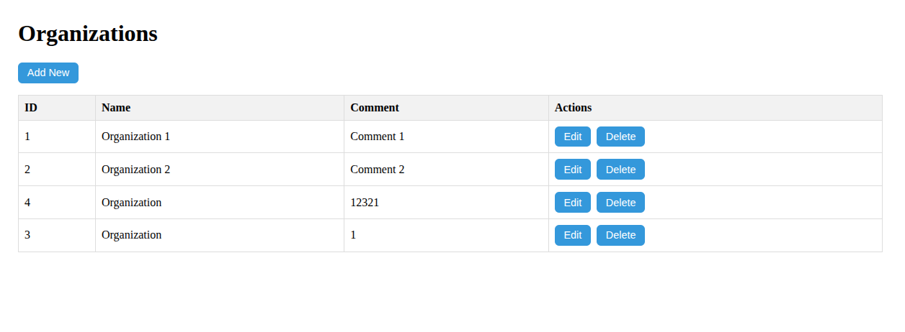
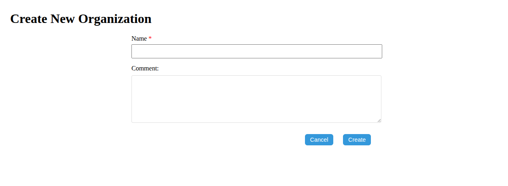
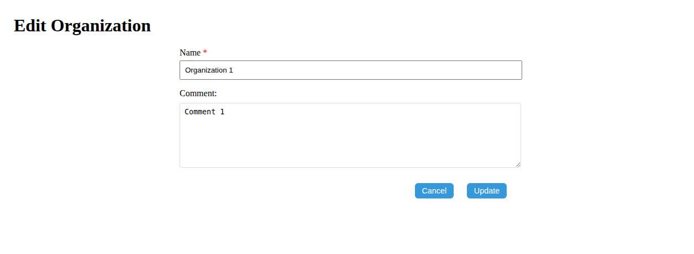
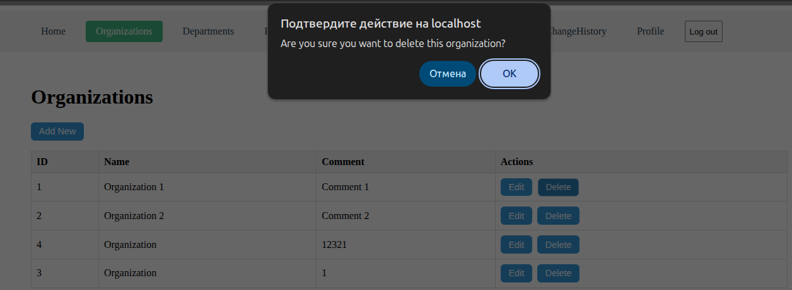

# Organizations API

Управление организациями.

---

## Список маршрутов

| Метод     | Путь                      | Описание                         |
|-----------|---------------------------|----------------------------------|
| GET       | `/api/organizations`      | Получить список всех организаций |
| GET       | `/api/organizations/:id`  | Получить организацию по ID       |
| POST      | `/api/organizations`      | Создать новую организацию        |
| PUT       | `/api/organizations/:id`  | Обновить организацию по ID       |
| DELETE    | `/api/organizations/:id`  | Удалить организацию по ID        |

---

## Структура таблицы `organization`

| Поле            | Тип              | Описание                   |
|-----------------|------------------|----------------------------|
| `id`            | `serial`         | Уникальный идентификатор   |
| `name`          | `varchar(255)`   | Название организации       |
| `comment`       | `text`           | Комментарий                |
| `created_at`    | `timestamp`      | Дата создания              |
| `updated_at`    | `timestamp`      | Дата последнего обновления |
| `deleted_at`    | `timestamp`      | Дата удаления              |

---

## Валидация

| Поле         | Тип       | Обязательное | Ограничения            |
|--------------|-----------|--------------|------------------------|
| `name`       | string    | да           | от 2 до 255 символов   |
| `comment`    | string    | нет          | может быть пустым      |

---

## Пример данных

```json
[
  {
    "id": 1,
    "name": "Organization 1",
    "comment": "Comment 1",
    "created_at": "2025-05-14T22:37:32.614Z",
    "updated_at": "2025-05-14T22:37:32.614Z",
    "deleted_at": null
  }
]
```

## Примеры запросов и ответов

### POST /api/organizations

Создание новой организации

Пример запроса
```json
{
  "name": "Organization",
  "comment": ""
}
```
Пример ответа (201 Created)
```json
{
  "id": 4,
  "name": "Organization",
  "comment": "",
  "created_at": "2025-05-18T21:11:30.223Z",
  "updated_at": "2025-05-18T21:11:30.223Z",
  "deleted_at": null
}
```

### PUT /api/organizations/3

Обновление информации об организации

Пример запроса
```json
{
    "name":"Organization",
    "comment":"1"
}
```
Пример ответа (200 OK)
```json
{
  "id": 3,
  "name": "Organization",
  "comment": "1",
  "created_at": "2025-05-18T21:10:58.159Z",
  "updated_at": "2025-05-18T21:16:19.203Z",
  "deleted_at": null
}
```

### DELETE /api/organizations/3

Удаление организации по ID

Пример запроса

```http
DELETE /api/organizations/3
```

Пример ответа (204 No Content)

Тело ответа отсутствует.

---

## Интерфейс пользователя

Ниже представлены скриншоты пользовательского интерфейса для управления организациями:

### Общий список организаций



---

### Создание организации



---

### Редактирование организации



---

### Удаление организации



---
