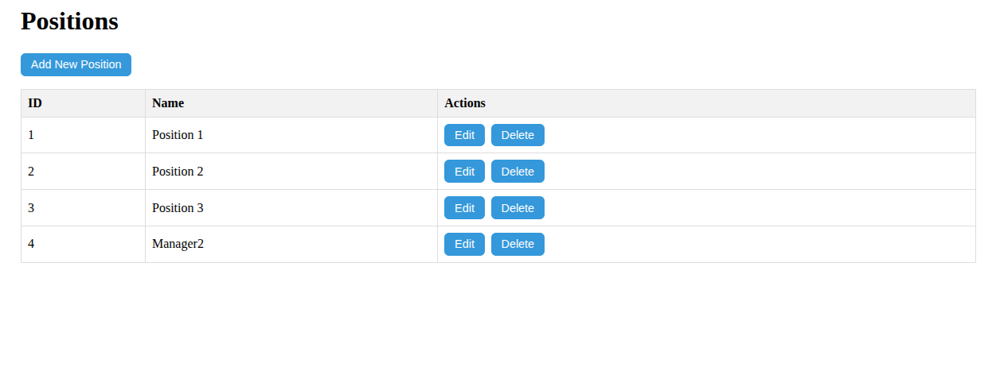
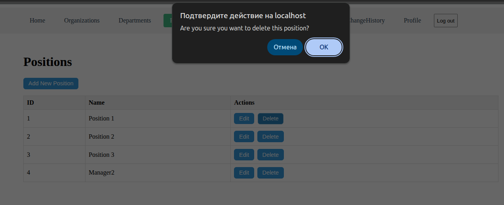

# Positions API

Управление должностями.

---

## Список маршрутов

| Метод       | Путь                    | Описание                        |
|-------------|-------------------------|---------------------------------|
| GET         | `/api/positions`        | Получить список всех должностей |
| GET         | `/api/positions/:id`    | Получить должность по ID        |
| POST        | `/api/positions`        | Создать новую должность         |
| PUT         | `/api/positions/:id`    | Обновить должность по ID        |
| DELETE      | `/api/positions/:id`    | Удалить должность по ID         |

---

## Структура таблицы `position`

| Поле         | Тип            | Описание                   |
|--------------|----------------|----------------------------|
| `id`         | `serial`       | Уникальный идентификатор   |
| `name`       | `varchar(255)` | Название должности         |
| `created_at` | `timestamp`    | Дата создания              |
| `updated_at` | `timestamp`    | Дата последнего обновления |
| `deleted_at` | `timestamp`    | Дата удаления              |

---

## Валидация

| Поле     | Тип    | Обязательное   | Ограничения          |
|----------|--------|----------------|----------------------|
| `name`   | string | да             | от 2 до 255 символов |

---

## Пример данных

```json
[
  {
    "id": 1,
    "name": "Position 1",
    "created_at": "2025-05-14T22:37:32.614Z",
    "updated_at": "2025-05-14T22:37:32.614Z",
    "deleted_at": null
  }
]
```

## Примеры запросов и ответов

### POST /api/positions

Создание новой должности

Пример запроса
```json
{
  "name":"Manager"
}
```
Пример ответа (201 Created)
```json
{
  "id": 4,
  "name": "Manager",
  "created_at": "2025-05-18T21:30:17.985Z",
  "updated_at": "2025-05-18T21:30:17.985Z",
  "deleted_at": null
}
```

### PUT /api/positions/4

Обновление информации о должности

Пример запроса
```json
{
  "name":"Manager2"
}
```
Пример ответа (200 OK)
```json
{
  "id": 4,
  "name": "Manager2",
  "created_at": "2025-05-18T21:30:17.985Z",
  "updated_at": "2025-05-18T21:31:48.657Z",
  "deleted_at": null
}
```

### DELETE /api/positions/4

Удаление должности по ID

Пример запроса

```http
DELETE /api/positions/4
```

Пример ответа (204 No Content)

Тело ответа отсутствует.

---

## Интерфейс пользователя

Ниже представлены скриншоты пользовательского интерфейса для управления должностями:

### Общий список должностей



---

### Создание должности


---

### Редактирование должности


---

### Удаление должности



---